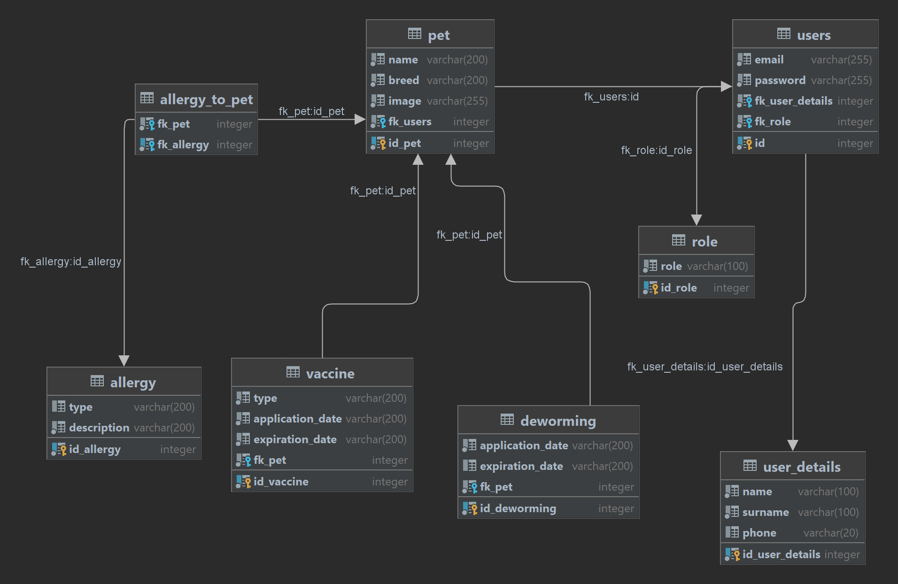

# AnimalStudy - web app
> Online health booklet for your pet

## Table of Contents
* [General Information](#general-information)
* [Technologies Used](#technologies-used)
* [Entity Relationship Diagram](#entity-relationship-diagram)
* [Features](#features)
* [Screenshots](#screenshots)
* [Usage](#usage)
* [Project Status](#project-status)
* [Room for Improvement](#room-for-improvement)
* [Contact](#contact)

## General Information

All your pet's information in one place.
You can easily check when your pet has been vaccinated, wormed or what it is allergic to.

## Technologies Used

Project is created with:
* PHP 8
* HTML 5
* CSS 3
* JavaScript 5
* PostgreSQL

## Entity Relationship Diagram

## Features

* Login to application with email and password
* General information about pet
* Displaying what the pupil is allergic to
* Showing information on vaccinations and deworming
* editing animal description

## Screenshots
Login Panel:

Description Panel:

Panel with Vaccinations:

Edit Form:

## Usage

### Bug / Feature Request
If you find a bug (the website couldn't handle the query and / or gave undesired results), kindly open an issue by including your search query and the expected result.
If you'd like to request a new function, feel free to do so by opening an issue. Please include sample queries and their corresponding results.

## Project Status
Project is: _in progress_ 

## Room for Improvement
* Adding, removing and editing information about vaccinations and deworming
* Ability to add and remove allergies from the list
* Make this booklet available to the person who is caring for your pet

## Contact
Created by Emilia Czaja - feel free to contact me by email!

e-mail: e.czajaaa@gmail.com